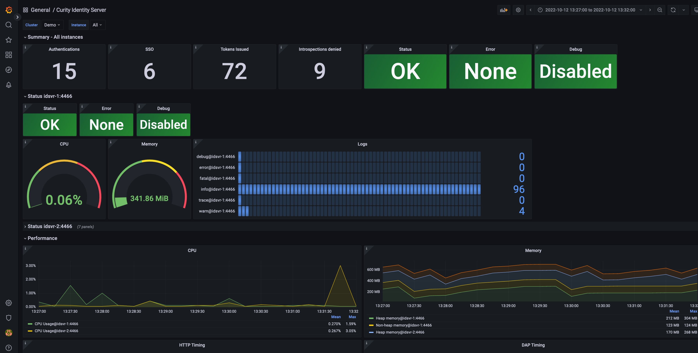

# Grafana Dashboard for Curity Identity Server

[](https://curity.io/resources/code-examples/status/)
[](https://curity.io/resources/code-examples/status/)

Curity Identity Server publishes Prometheus-compliant metrics. Grafana is a tool that can be used to visualize the metrics collected by Prometheus.
This repository provides a preconfigured dashboard that shows the most important metrics of the Curity Identity Server. Feel free to download the `idsvr-dashboard.json` file and import it into your Grafana instance to view all the stats of your Curity Identity Server instance.

# Prerequisites

To use this dashboard, you must have an environment that has at least the following systems installed:

* An instance of Curity Identity Server with metrics enabled (enabled by default and listening on port 4466)
* An instance of Prometheus that polls the metrics from the Curity Identity Server.
Check out [Getting Started with Prometheus](https://prometheus.io/docs/prometheus/latest/getting_started/)
* An instance of Grafana with a data source configured that points to the Prometheus instance above:
Check out [Getting Started with Grafana](https://grafana.com/docs/grafana/latest/guides/getting_started/)

# Version History

| Version | Changes |
|---------|---------|
| 2.0     | Since version 2.0. this dashboard is configured to work with versions of the Curity Identity Server from 7.0. onwards. For previous versions of the Curity Identity Server use version 1.0.2 of the dashboard. |
| 3.0     | The release includes various fixes and updates. <br/> <ul> <li>Fix template variables</li><li>Fix broken queries</li><li>Use memory areas in Memory panel</li> <li>Use token types and ACR in authentication related panels</li><li>Add counter for logins</li><li>Add JDBC pool metrics</li></ul> The dashboard requires now Grafana 9.6.1 and Curity Identity Server 7.4.0 for JDBC based metrics |

# Structure and Features

The dashboard has several sections focusing on a cluster-wide overview, instance specific overviews, performance, authentication related metrics and metrics from a JDBC pool. You can use the same dashboards with several clusters and instances



Check out the [detailed description of the dashboard](https://curity.io/resources/learn/grafana-dashboard/) for more guidance on the different components and how to use the dashboard.

# Quickstart Guide

If you have an existing installation of the Curity Identity Server, Prometheus and Grafana, just add this dashboard by importing [idsvr-dashboard.json](idsvr-dashboard.json) in Grafana.


# Exploring the Dashboard Using Docker

If you just want to review the dashboard, consider to set up your environment using Docker. For that purpose configuration files for Prometheus and Grafana as well as a docker compose file were added to the repository. It also contains resources necessary to create a database and an instance of the Curity Identity Server that integrates with the database. Using `docker compose` you can configure and start the required containers with a single command.

## Start Containers

Just [download a license](https://developer.curity.io/licenses), and save it in `config/idsvr/license.json`. Then, run the following command inside the repository to create an environment:

```
docker compose up
```

This will set up the following containers with the necessary ports forwarded where required:

* idsvr
* database
* prometheus
* grafana

The containers' names are also the hostnames that are used in configuration files. Docker daemon will handle the name resolution and routing.

## Accessing Endpoints

The systems are preconfigured. Just access Grafana with the default credentials `admin:admin` (see [Grafana Configuration](https://grafana.com/docs/grafana/latest/installation/configuration/#admin-user)).

| Endpoint                       | Description                                                  |
|--------------------------------|--------------------------------------------------------------|
| https://localhost:6749/admin   | Admin UI for Curity Identity Server                          |
| http://localhost:4466/metrics  | Raw metrics published by Curity Identity Server              |
| http://localhost:9090/targets  | Endpoint to check status of targets configured in Prometheus |
| http://localhost:3000          | Grafana Web UI                                               |


For login to the [Admin UI of the Curity Identity Server](https://localhost:6749/admin) use the credentials `admin:Password1`.

## Teardown

Once you're done with evaluating the dashboard run `docker compose down` to remove any created containers.

# Contributing

Pull requests are welcome. To do so, just fork this repo, and submit a pull request.

# License

The files and resources maintained in this repository are licensed under the [Apache 2 license](LICENSE).

# More Information

Please visit [curity.io](https://curity.io/) for more information about the Curity Identity Server.

Copyright (C) 2020 Curity AB.
